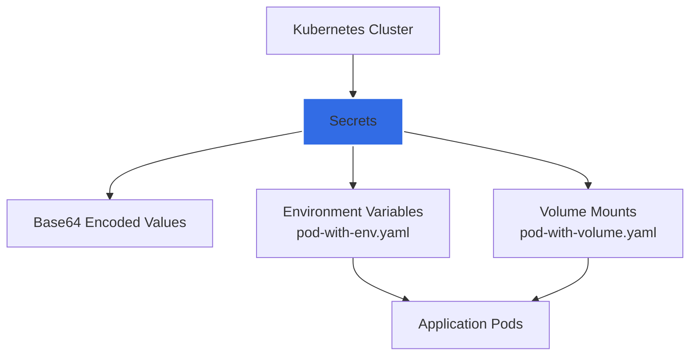

# 🔐 Advanced Kubernetes Secrets Management: A Comprehensive Implementation

[](https://github.com/TheToriqul/k8s-secret)


## 📋 Project Overview

This project demonstrates advanced implementation patterns for managing sensitive information in Kubernetes environments using Secrets. It provides a comprehensive exploration of secure configuration management, from basic secret creation to advanced deployment patterns with RBAC integration.

### Key Features
- Secure storage and management of sensitive data
- Multiple secret implementation patterns
- RBAC-based access control
- Production-ready deployment configurations
- Comprehensive documentation and examples

## 🏗️ Repository Structure

```
k8s-secret/
├── yaml/                          # Kubernetes configuration files
│   ├── basic-secret.yaml         # Base secret configuration
│   ├── pod-with-env.yaml         # Pod with environment variables
│   ├── pod-with-volume.yaml      # Pod with volume mounts
│   ├── deployment.yaml           # Full deployment example
│   └── rbac.yaml                 # RBAC configuration
├── docs/
│   └── reference-commands.md     # Detailed command reference
├── architecture.png              # Deployment architecture
└── README.md                     # Project documentation
```

## 💻 Technical Implementation

### Secret Management Patterns

1. **Basic Secret Creation**
   - Imperative command approach
   - YAML-based declarative configuration
   - Base64 encoding and decoding
   - Secret verification and validation

2. **Environment Variable Integration**
   - Direct secret-to-environment mapping
   - Selective value exposure
   - Runtime configuration management
   - Secure variable injection

3. **Volume Mount Implementation**
   - Secure file-based secret access
   - Read-only mount configurations
   - Dynamic secret updates
   - Volume permission management

4. **Deployment Strategies**
   - Multi-container secret sharing
   - Rolling update support
   - High availability considerations
   - Resource management

### Security Features

- Base64 encoding for sensitive data
- RBAC-based access control
- Namespace isolation
- Read-only access patterns
- Service account integration

## 🚀 Getting Started

### Prerequisites

<details>
<summary>System Requirements</summary>

- Kubernetes cluster (v1.19+)
- kubectl CLI tool
- Basic understanding of Kubernetes concepts
- Cluster administrative access
- Base64 encoding/decoding capability
</details>

### Installation Steps

1. Clone the repository:
```bash
git clone https://github.com/TheToriqul/k8s-secret.git
cd k8s-secret
```

2. Create the basic secret:
```bash
kubectl apply -f yaml/basic-secret.yaml
```

3. Implement RBAC configuration:
```bash
kubectl apply -f yaml/rbac.yaml
```

4. Deploy the example application:
```bash
kubectl apply -f yaml/deployment.yaml
```

For detailed implementation steps, refer to [reference-commands.md](docs/reference-commands.md).

## 💡 Technical Deep Dive

### Secret Storage and Encoding

Kubernetes Secrets are stored in etcd and use base64 encoding. While this encoding is not encryption, it provides:
- Character set compatibility
- Binary data support
- Standard data format

### Access Control Implementation

The project implements a comprehensive RBAC system:
- Role-based access definition
- Service account integration
- Namespace-scoped permissions
- Principle of least privilege

### Deployment Architecture



This architecture demonstrates the flow of secret management in our Kubernetes implementation:

1. **Kubernetes Cluster**: The foundation of our infrastructure
2. **Secrets Management Layer**: Handles all secret-related operations
3. **Distribution Methods**:
   - Encoded Secrets Store: Central storage for base64 encoded secrets
   - Volume Mounts: File-based secret access
   - Environment Variables: Direct injection into containers
4. **Applications**: Consume secrets through these various methods

This layered approach ensures:
- Secure storage and transmission of sensitive data
- Flexible access methods for different use cases
- Centralized management and control
- Consistent security practices across applications

## 📚 Implementation Examples

### Basic Secret Creation
```yaml
apiVersion: v1
kind: Secret
metadata:
  name: my-db-secret
type: Opaque
data:
  DB_Host: bXlzcWw=
  DB_User: cm9vdA==
  DB_Password: cGFzd3Jk
```

### Environment Variable Usage
```yaml
env:
- name: DATABASE_HOST
  valueFrom:
    secretKeyRef:
      name: my-db-secret
      key: DB_Host
```

## 🔄 Future Enhancements

<details>
<summary>Planned Improvements</summary>

1. **External Integration**
   - HashiCorp Vault integration
   - AWS Secrets Manager support
   - Azure Key Vault connectivity

2. **Advanced Security**
   - Automated secret rotation
   - Encryption at rest
   - Audit logging

3. **Operational Features**
   - GitOps workflow integration
   - Multi-cluster synchronization
   - Backup and recovery procedures
</details>

## 🤝 Contributing

I welcome contributions that enhance this project's capability to demonstrate secure secret management in Kubernetes. Please:

1. Fork the repository
2. Create a feature branch
3. Commit your changes
4. Push to the branch
5. Create a Pull Request

## 🎓 Learning Outcomes

Through this project, I've mastered:

1. **Technical Skills**
   - Kubernetes secret management
   - YAML configuration
   - Base64 encoding/decoding
   - RBAC implementation

2. **Security Concepts**
   - Secure configuration management
   - Access control patterns
   - Secret rotation strategies
   - Security best practices

3. **DevOps Practices**
   - Infrastructure as Code
   - Configuration management
   - Deployment strategies
   - Documentation practices

## 📧 Connect with Me

- 📧 Email: toriqul.int@gmail.com
- 📱 Phone: +65 8936 7705, +8801765 939006
- 🌐 LinkedIn: [@TheToriqul](https://www.linkedin.com/in/thetoriqul/)
- 🐙 GitHub: [@TheToriqul](https://github.com/TheToriqul)
- 🌍 Portfolio: [TheToriqul.com](https://thetoriqul.com)

## 👏 Acknowledgments

- [Poridhi](https://devops.poridhi.io/) for comprehensive learning resources
- The Kubernetes community for excellent documentation
- Contributors and reviewers of this project

## 📚 Additional Resources

- [Kubernetes Secrets Documentation](https://kubernetes.io/docs/concepts/configuration/secret/)
- [RBAC Documentation](https://kubernetes.io/docs/reference/access-authn-authz/rbac/)
- [Base64 Encoding](https://en.wikipedia.org/wiki/Base64)

---

Thank you for exploring my Kubernetes Secrets management project. I hope this implementation provides valuable insights for your cloud-native security journey. Happy Learning! 🚀